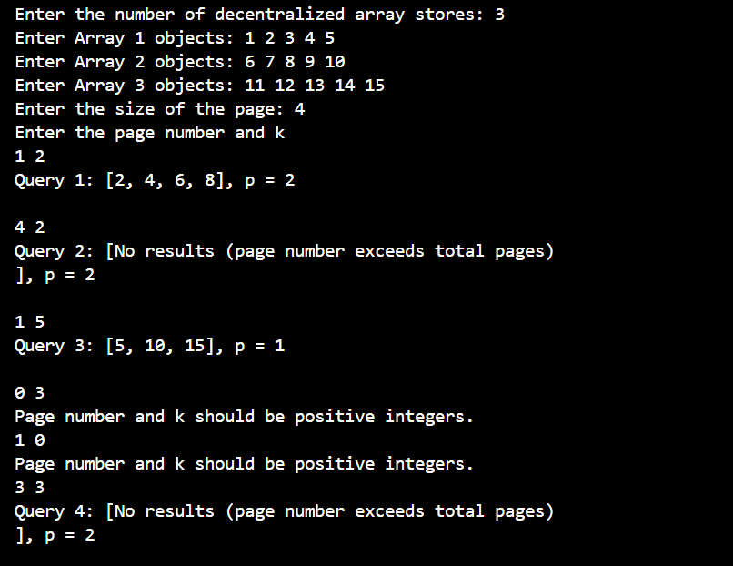
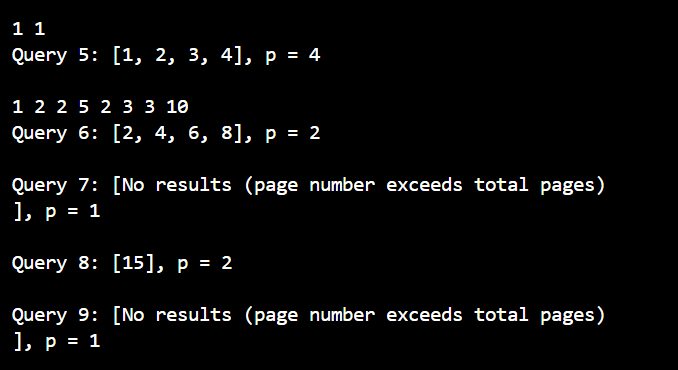

## Decentralized Array Store Pagination

### Overview

You are given a collection of decentralized array stores. Each store contains a varying number of heterogeneous objects. You need to design an efficient pagination system that allows a server X to fetch data from these array stores. The goal is to implement pagination in a way that maintains speed and efficiency.

### Input

1. N - the number of decentralized 𝑁 array stores.
2. For each array store 𝑖, an array of objects 𝐴𝑖 where 1 ≤ 𝑖 ≤ 𝑁.
3. 𝑃 - the page size, i.e., the number of objects to display per page.
4. 𝑄 - a series of queries where each query requests a specific page number and a number
𝑘, where 𝐴𝑖 % 𝑘 = 0.

### Output

1. Total number of pages 𝑝.
2. For each query 𝑄𝑖, return the objects corresponding to the requested page, efficiently
paginated across the different array stores.

### Constraints

- 1 ≤ 𝑁 ≤ 100
- 0 ≤ 𝐴𝑖 ≤ 10^5 for each 𝑖
- 1 ≤ 𝑃 ≤ 10^5
- 1 ≤ 𝑄 ≤ 10^5

### Prerequisites

- A C++ compiler (e.g., g++, clang++)
- Standard C++ library

### Compilation

To compile the program, use the following command:

```
g++ -o DecentralizedArrayStorePagination main.cpp
```
### Algorithm and Code Logic

1. **Initialization**
   - **Number of Stores**: Prompt for and validate the number of stores (`N`). Abort if non-positive.
   - **Input Arrays**: Read arrays for each store until a newline or invalid input is encountered.
   - **Page Size**: Prompt for and validate the page size. Abort if non-positive.

2. **Query Processing**
   - **Cache Setup**: Use an unordered map (`filteredCache`) to store results for each divisor `k`.
   - **Process Queries**:
     - Validate `pageNumber` and `k`. Skip invalid queries.
     - **Filter and Cache**: If results for `k` are not cached, filter elements divisible by `k` from all stores and cache them.
     - **Pagination**:
       - Calculate total pages:
         ```cpp
         int totalPages = (filteredObjects.size() + pageSize - 1) / pageSize;
         ```
       - Extract objects for the specified page:
         ```cpp
         int startIdx = (pageNumber - 1) * pageSize;
         int endIdx = min(startIdx + pageSize, filteredObjects.size());
         ```
     - **Output**:
       - If the page number is out of range, display "No results (page number exceeds total pages)".
       - Otherwise, print the filtered objects and total pages.

3. **Error Handling**
   - Handle non-integer inputs and ensure page number and size are valid.

### Time and Space Complexity

- **Time Complexity**: `O(N * M + Q * (P + M))`
  - Where:
    - `N` = Number of arrays
    - `M` = Average number of elements per array
    - `Q` = Number of queries
    - `P` = Number of filtered elements per query

- **Space Complexity**: `O(N * M + Q * P)`
  - Where:
    - `N` = Number of arrays
    - `M` = Average number of elements per array
    - `Q` = Number of queries
    - `P` = Number of filtered elements per query


### Example Usage




### Contact Us

For any questions or support, please contact meghawadhwa20@gmail.com.
